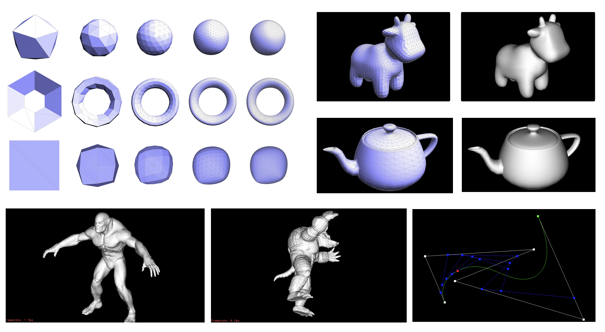

# Mesh-Editor
A mesh editor that renders and edits basic COLLADA mesh files

## Write-Up
You can read my detailed [writeup](https://michael-tu.github.io/Mesh-Editor/) to understand what features I have implemented, how I developed them, see many of the cool results, and view side-by-side comparisons of the performance by different techniques.

## Glimpse of Results



## Using the GUI

_Note: You have to run the executable insdie the `build` folder, which will be explained in the next section_

The meshedit executable takes exactly one argument from the command line. You may load a single COLLADA file by specifying its path. 

For example, to load the example file `dae/quadball.dae` from your build directory:
    
```
./meshedit ../dae/quadball.dae
```

### Bezier Curve and Surfaces

To load Bezier curves, run a command such as:

```
./meshedit ../bzc/curve1.bzc
```

To load Bezier surfaces, run a command such as:

```
./meshedit ../bez/teapot.bez
```

### Mesh Manipulation

The editor supports functionalities like moving vertices around in space. You can do by just clicking and dragging on a vertex. You can also rotate the camera by right-clicking and dragging (or dragging on the background), and zoom in and out using the scroll wheel or multi-touch scrolling on a trackpad. Hitting the spacebar will reset the view. 

As you move the cursor around the screen, you'll notice that mesh elements (faces, edges, and vertices) under the cursor get highlighted. Clicking on one of these elements will display some information about the element and its associated data like its `halfedge` data structures.

The editor also allows you to modify the mesh in a variety of ways. Each of these methods is exposed through the viewer. There are two basic types of operations. 

Each operation will be executed with a key press.

- **Local flip (F) and split (S) operations**: modify the mesh in a small neighborhood around the currently selected mesh element.

- **Loop subdivision (U)**: refine and smooth the entire mesh.

To load a mesh, run a command such as:

```
./meshedit ../dae/teapot.dae
```

### Keyboard Controls

Here is the full specification on **keyboard controls** for the GUI:

Command | Key
------- | -----
Flip the selected edge  | F
Split the selected edge | S
Upsample the current mesh   | U
Toggle information overlay  | I
Select the next halfedge    | N
Select the twin halfedge    | T
Switch to GLSL shaders  | W
Switch between GLSL shaders | 0-9
Toggle using area-averaged normals  | Q
Recompile shaders   | R
Reset camera to default position    | SPACE
Edit a vertex position  | (click and drag on vertex)
Rotate camera   | (click and drag on background, or right click)


Note that each COLLADA file may contain multiple mesh objects; more generally, a COLLADA file describes a **scene graph** (much like SVG) that is a hierarchical representation of all objects in the scene (meshes, cameras, lights, etc.), as well as their coordinate transformations. Global resampling methods will be run on whichever mesh is currently selected.


## Build System

If you don't have [CMake](https://cmake.org) (version >= 2.8) on your personal computer, you can install it using `apt-get` on Linux or `Macports/Homebrew` on OS X. Alternatively, you can download it directly from the CMake website.

To build the code, start in the folder that GitHub made or that was created when you unzipped the download. 

Run
```
mkdir build; cd build
```

to create a build directory and enter it, then

```
cmake ..
```

to have CMake generate the appropriate Makefiles for your system, then

```
make 
```

to make the executable, which will be deposited in the build directory.

